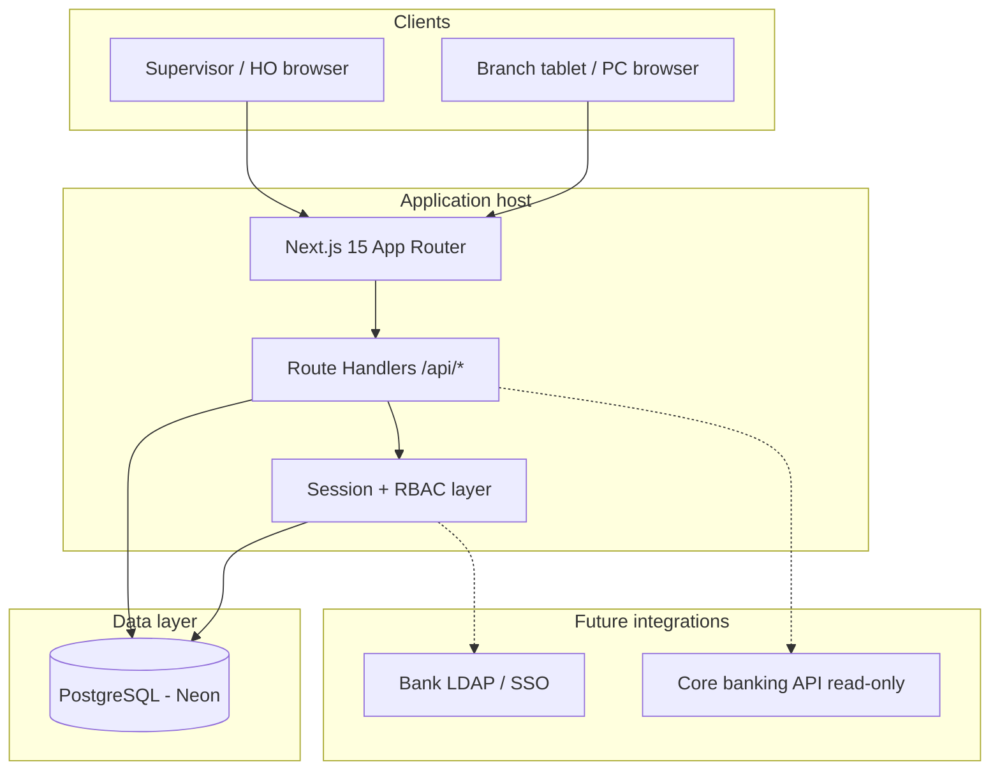
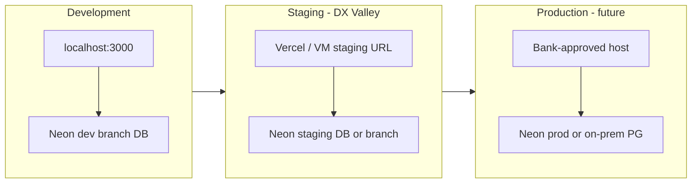
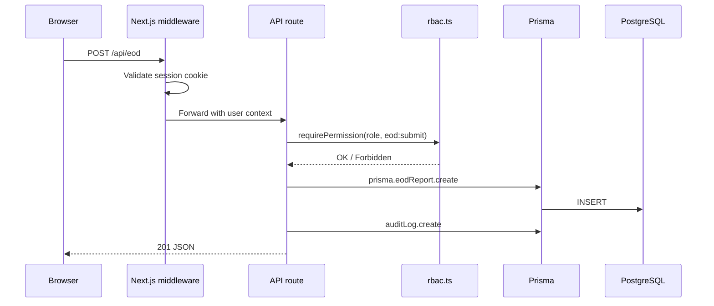

# MaatiiLink — System Architecture v1.0

**Team:** SABA CODERS | **Phase 2** | May 2026

---

## 1. High-level architecture



---

## 2. Component responsibilities

| Layer | Technology | Responsibility |
|-------|------------|----------------|
| UI | React 19 + Tailwind | Branch / supervisor screens per wireframes |
| App server | Next.js 15 | SSR, routing, API route handlers |
| Auth | HTTP-only session cookie + bcrypt | Login, logout, role checks |
| RBAC | `src/lib/rbac.ts` | Permission matrix enforced per request |
| ORM | Prisma 5 | Schema, migrations, type-safe queries |
| Database | Neon PostgreSQL | Primary datastore (SSL required) |
| Audit | `src/lib/audit.ts` | Append-only compliance log |

---

## 3. Deployment topology



| Environment | URL pattern | Database |
|-------------|-------------|----------|
| Local | `http://localhost:3000` | Neon dev (`.env`) |
| Staging | `https://maatiilink-staging.*` (set when deployed) | Separate Neon project/branch |
| Production | Bank IT assigned | Isolated DB, no dev credentials |

---

## 4. Request flow (authenticated API)



---

## 5. Security boundaries

- Browser never stores passwords after login (session only).
- No customer PII or ledger writes in v1.
- All `/api/*` except health + login require session (see `PUBLIC_API_PATHS` in `rbac.ts`).
- Prisma parameterized queries only (no raw SQL in MVP).

---

## 6. Code map

```
src/
  app/              # Pages + API routes
  lib/
    prisma.ts       # DB client singleton
    rbac.ts         # Permissions (Phase 2)
    audit.ts        # Audit writer
    auth/           # Session helpers (Sprint 1)
middleware.ts       # Route protection (Sprint 1)
prisma/
  schema.prisma     # Source of truth
  migrations/       # Versioned SQL
```

---

## 7. Gate G2 — Team approval

| Item | Status |
|------|--------|
| Architecture reviewed by SABA CODERS | Approved May 2026 |
| Staging plan documented | `STAGING.md` |
| CI pipeline | `.github/workflows/ci.yml` |
